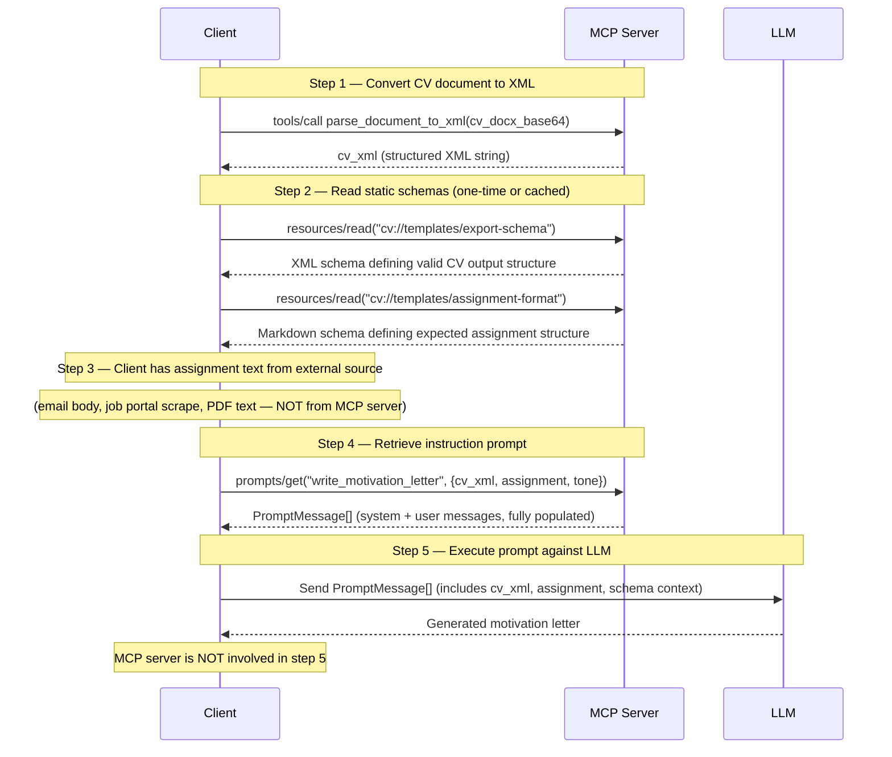

# ADR-003: MCP Resource vs Prompt — Decision Rule for Templates and Data

**Status:** Accepted
**Date:** 2026-06-18
**Issue:** [#22](https://github.com/pkuppens/document-xml-mcp/issues/22)

---

## Context

MCP has two primitives that can both feel "template-like": **Resources** and **Prompts**. The difference is subtle but consequential for how clients use them.

- **Resource** — data the LLM reads as context (via `resources/read`). The server provides the content; the LLM incorporates it into its reasoning.
- **Prompt** — instructions the LLM follows (via `prompts/get`). The server provides the recipe; the LLM executes it.

For the CV use case, we have candidates that look like templates:
- A CV XML export schema (defines the target structure)
- An assignment description format (defines the expected input structure)
- Instruction templates for gap analysis, letter writing, etc.

Misclassifying these leads to wrong client behavior: a client that calls `prompts/get` to get a schema will be confused; a client that calls `resources/read` to get instructions will not know to apply them.

---

## Decision Rule

**Use a Resource when:**
1. **The LLM needs to *read* it to know a structure, constraint, or fact before generating output**
2. It is reference data — a schema, example, glossary, or specification
3. It has a natural URI (it "lives" at an address, like a document)
4. Changing it changes what the LLM knows, not what the LLM does

**Use a Prompt when:**
1. **The LLM needs to *follow* it as a task description or workflow**
2. It is parameterized — slots that get filled with per-call data (`{cv_xml}`, `{job_description}`)
3. It describes a sequence of steps or a reasoning strategy
4. Changing it changes what the LLM does, not what it knows

**Quick test:** Replace the template with "read this carefully" vs "follow these instructions." Which sounds right? If "read this," it's a Resource. If "follow these," it's a Prompt.

---

## Flowchart

```
Is it parameterized with per-call data?
├── Yes → Prompt (parameters make it an instruction template)
└── No → Is it data the LLM reads as context?
    ├── Yes → Resource
    └── No → Reconsider whether it belongs in MCP at all
```

---

## Classification of CV Templates

### CV XML Export Schema
**Decision: Resource** — `cv://templates/export-schema`

The export schema defines the XML structure the LLM must produce when rewriting or generating CV content. The LLM *reads* it to understand constraints. It is a specification, not an instruction.

- Not parameterized (same schema every time)
- The LLM reads it before generating → Resource
- Has a natural URI: `cv://templates/export-schema`
- MIME type: `application/xml`

### Assignment Description Format
**Decision: Resource** — `cv://templates/assignment-format`

The assignment format defines the **schema/structure** of a well-formed job description — what fields are expected, what format they take, how to distinguish role requirements from company background. The LLM reads it to know how to parse and interpret assignments. It is reference data about the expected *shape* of an assignment, not a reference to any specific assignment.

> **Scope note:** This resource describes the structure of an assignment document, not the assignment data itself. Actual assignment content (from email, a job portal, a PDF) is supplied by the client at call time as a parameter to `prompts/get` — it is not stored in or read from the MCP server.

- Not parameterized (same schema for all assignments)
- The LLM reads it to understand the expected input structure → Resource
- Has a natural URI: `cv://templates/assignment-format`
- MIME type: `text/markdown` or `text/plain`

### Gap Analysis Instruction (`analyze_cv_gaps`)
**Decision: Prompt** *(see ADR-002)*

Parameterized (`cv_xml`, `job_description`). Tells the LLM what to do (analyze, compare, list gaps). Changing it changes behavior. → Prompt.

### Motivation Letter Instruction (`write_motivation_letter`)
**Decision: Prompt** *(see ADR-002)*

Parameterized. Tells the LLM to generate text following a pattern. → Prompt.

---

## Consequences

1. `cv://templates/export-schema` and `cv://templates/assignment-format` will be registered via `@mcp.resource()` in `src/xml_processing_mcp/server.py`.
2. Template files are stored as static files in `src/xml_processing_mcp/resources/templates/` and committed to the repo.
3. Clients that need the export schema call `resources/read("cv://templates/export-schema")` — they don't need to hard-code the schema.
4. The four instruction templates (gap analysis, letter writing, etc.) are registered as Prompts — clients call `prompts/get(name, args)`.
5. If a resource needs to become dynamic in the future (e.g., per-user CV schemas), FastMCP supports parameterized resource URIs (e.g., `cv://users/{user_id}/schema`).

---

## Review Trigger

> **Important:** These reclassification conditions arise naturally as the system evolves. Catching them early prevents clients from calling the wrong primitive and receiving confusing results.

Revisit if:
- A "resource" needs parameters → consider parameterized resource URI (e.g., `cv://users/{user_id}/schema`) or reclassify as Prompt
- A "prompt" has no parameters and is purely reference text → consider reclassifying as Resource
- Dynamic resources (per-user, per-CV) are needed → use parameterized URIs

---

## Sequence: CV Motivation Letter Generation

How Resources and Prompts combine in a typical client workflow:



**Key observations:**
- The MCP server participates in steps 1–4 only; the LLM call (step 5) is client-side.
- Resources (steps 2) are typically read once and cached; they define *what* the LLM needs to know.
- The prompt (step 4) is where per-call data (`cv_xml`, `assignment`) is injected; it defines *what* the LLM needs to do.
- Assignment content arrives at the client from external channels; the MCP server stores only the structural schema for what a valid assignment looks like.
